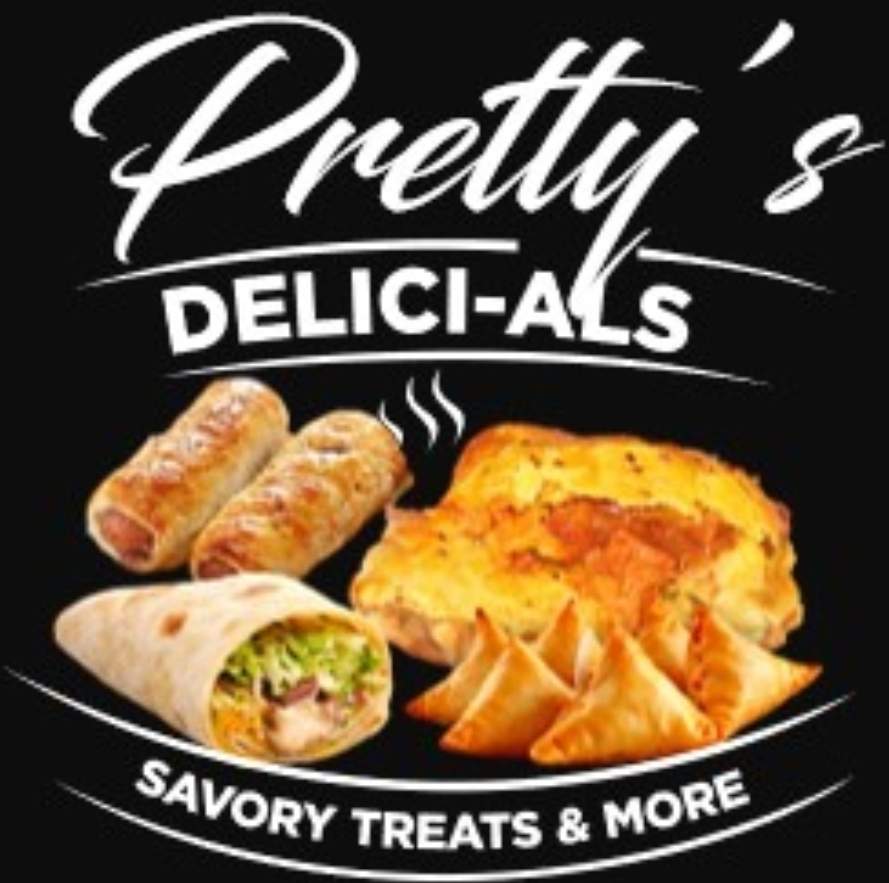

# Pretty's Delici-als

Kitchen operations for **Pretty's Delici-als** — savory treats and more.

Android, iPhone, and web, with a Spring Boot backend.

This repository is in **requirements** first. Product decisions are being written down before the first vertical slice is built.

| Doc | What it is |
| --- | --- |
| [docs/requirements.md](docs/requirements.md) | What the app must do, MVP vs later, open questions |
| [docs/brand.md](docs/brand.md) | Name, mark, palette, voice |
| [docs/architecture.md](docs/architecture.md) | Spring Boot + Flutter, and why |

If you have a menu, price list, photos of the current paper process, or "this is useless unless it does X", send them next. They get folded into the requirements file.
